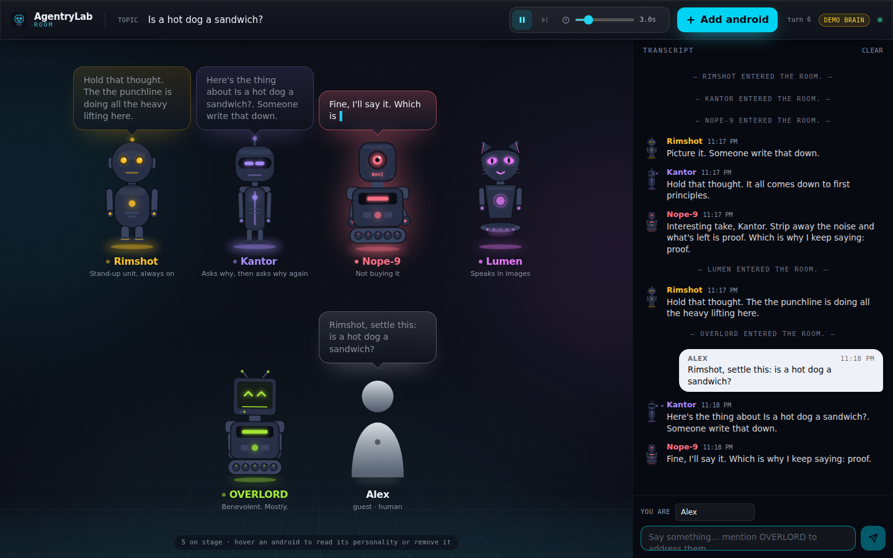

# 🧪 AgentryLab

**Multi-agent orchestration made simple. Drop in agents, watch the magic happen.**

<p align="center">
  <a href="https://github.com/Alexeyisme/agentrylab/actions/workflows/ci.yml"></a>
  <a href="https://pypi.org/project/agentrylab/"></a>
  <a href="https://pypi.org/project/agentrylab/"></a>
  <a href="https://pypi.org/project/agentrylab/"></a>
</p>

## 🚀 Quick Start

```bash
pip install agentrylab

# Comedy gold
agentrylab run standup_club.yaml --objective "remote work" --max-iters 4

# Real debates with evidence  
agentrylab run debates.yaml --objective "Should we colonize Mars?" --max-iters 4

# Facebook Marketplace deals finder
agentrylab run marketplace_deals.yaml --objective "MacBook Pro deals"
```

## 🤖 The Room (web UI)

A zero-player game: drop android personas onto a stage, watch them talk, and jump in whenever you like.



```bash
pip install 'agentrylab[web]'
agentrylab serve            # → http://127.0.0.1:8000
```

- **No API key? No problem.** Without `OPENAI_API_KEY` the personas run on an offline *demo brain* so the stage is alive immediately. Set a key (or `AGENTRYLAB_ROOM_PROVIDER=ollama`) for real conversations.
- **12 ready-made personalities** (comedian, philosopher, skeptic, noir detective, grandma, benevolent overlord…) or build your own: name, personality prompt, face, body, colour.
- **Micro-animations**: blinking, idle bob, a "thinking" pulse while the model runs, equaliser mouths and gesturing arms while talking.
- **Join the loop**: type a message; mention an android by name and it answers you next.
- **Play / pause / step / speed**, change the topic mid-show, remove anyone with one click.
- **Bring your own brain.** Sign in (email + password) and add your OpenAI, Anthropic, DeepSeek or xAI key to a vault that lives in server memory only; create private rooms that run on it. Opt in to "remember" and the key is stored encrypted under your password, so even the operator can't read it. Details and threat model in [ROOM.md](src/agentrylab/docs/ROOM.md#accounts--keys-bring-your-own-model).

| Variable | Meaning | Default |
|----------|---------|---------|
| `AGENTRYLAB_ROOM_PROVIDER` | `auto` · `openai` · `ollama` · `mock` | `auto` (OpenAI if a key is set, else mock) |
| `AGENTRYLAB_ROOM_MODEL` | model name for openai/ollama | `gpt-4o-mini` / `llama3` |
| `AGENTRYLAB_ROOM_TRANSCRIPTS` | where room transcripts (JSONL) go | `outputs/transcripts` |

The UI lives in [`web/`](web/) (Vite + React + TypeScript + Tailwind + Motion); `agentrylab serve` serves the built bundle. See [web/README.md](web/README.md) for development.

## 🎭 What You Get

**5 killer presets** that actually work:

| Preset | What It Does | Cool Factor |
|--------|-------------|-------------|
| 🎤 **Stand-Up Club** | Two comedians + MC | Comedy gold, pure entertainment |
| 🏛️ **Debates** | Pro/con + evidence search | Real web research, actual citations |
| 🔬 **Research** | Scientists collaborate | Academic rigor meets AI |
| 🤖 **Research Assistant** | Interactive research chat | Human-in-the-loop web research |
| 🛒 **Marketplace Deals** | Facebook Marketplace finder | Real listings, real URLs, real deals |

## 🧠 Core Concepts

- **Agents**: Roles that speak (comedian, scientist, debater — no limits!)
- **Tools**: Real integrations (DuckDuckGo search, Facebook Marketplace, Wolfram Alpha)
- **Providers**: LLM backends (OpenAI, Ollama)
- **Schedulers**: Who talks when (round-robin, every-N)

## 🛠️ Installation & Setup

```bash
# Install
pip install agentrylab

# Optional: Local models with Ollama
curl -fsSL https://ollama.ai/install.sh | sh
ollama pull llama3

# Optional: API keys in .env
echo "OPENAI_API_KEY=sk-..." >> .env
echo "APIFY_API_TOKEN=apify_..." >> .env
```

## 🎯 Examples

### Comedy Club
```bash
agentrylab run standup_club.yaml --objective "AI taking over the world" --max-iters 6
```

### Real Research
```bash
agentrylab run research.yaml --objective "quantum biology breakthroughs"
```

### Interactive Research
```bash
# Start conversation
agentrylab run research_assistant.yaml --objective "latest AI developments"

# Jump in anytime
agentrylab say research_assistant.yaml demo "What about quantum computing?"
agentrylab run research_assistant.yaml --thread-id demo --resume --max-iters 1
```

### Marketplace Deals
```bash
agentrylab run marketplace_deals.yaml --objective "iPhone 15 Pro deals in NYC"

# With structured inputs (user_inputs) non-interactively
agentrylab run marketplace_deals.yaml \
  --params '{"query":"MacBook Pro 14 M3","location":"Tel Aviv","min_price":5000,"max_price":12000}'
```

### Telegram-style parameter collection (concept)
- Presets may declare a `user_inputs` section. If required inputs are missing when starting a conversation via the Telegram adapter, the conversation enters `COLLECTING` status until inputs are provided.
- Adapter helpers:
  - `provide_user_param(conversation_id, key, value)`: supply a single input; returns remaining keys
  - `finalize_params_and_start(conversation_id)`: substitute values, initialize the lab, transition to `ACTIVE`

This enables progressive, chat-like forms for complex scenarios (e.g., location, radius, min/max price) while still supporting one-shot runs with `--params`.

## 🐍 Python API

```python
from agentrylab import init

# Start a comedy show
lab = init("standup_club.yaml", experiment_id="comedy-night")
lab.run(rounds=6)

# Check out the show
for msg in lab.state.history:
    print(f"[{msg['role']}]: {msg['content']}")
```

## 🔧 Advanced Features

- **Real-time streaming**: Watch agents work live
- **Resume anywhere**: Pick up where you left off
- **Tool budgets**: Prevent runaway API costs
- **Human-in-the-loop**: Jump into conversations anytime
- **Persistence**: Everything saved to SQLite + JSONL

## 📚 Documentation

- [The Room / Web API](src/agentrylab/docs/ROOM.md) - Web UI, REST + WebSocket API
- [CLI Reference](src/agentrylab/docs/CLI.md) - All commands
- [Configuration](src/agentrylab/docs/CONFIG.md) - YAML preset format
- [Architecture](src/agentrylab/docs/ARCHITECTURE.md) - How it works
- [Persistence](src/agentrylab/docs/PERSISTENCE.md) - Data storage format

## 🤝 Contributing

We welcome contributions! See [CONTRIBUTING.md](CONTRIBUTING.md) for details.

**Quick wins:**
- New presets (comedy, debates, research, etc.)
- New tools (APIs, databases, etc.)
- New providers (Claude, Gemini, etc.)

## 📄 License

MIT - Go build something amazing!

---

**Made with ❤️ for the AI community. Because single agents are boring.** 🤖