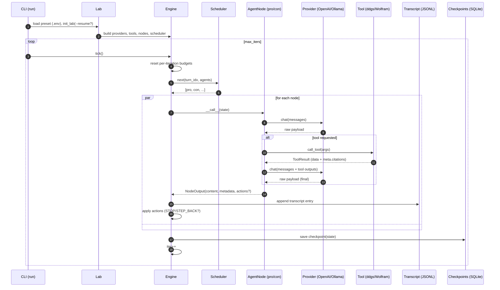

Agentry Lab Architecture 🏗️

This document explains how the lab is structured end‑to‑end: how presets are
loaded, how the runtime is built (providers, tools, nodes, scheduler, engine),
how state and persistence work, and how the CLI orchestrates a run.

Overview ✨
- Preset (YAML): declarative room configuration (providers, tools, nodes,
  schedule, persistence, budgets, message contracts).
- Loader (Pydantic v2): validates and normalizes the YAML into a `Preset` model
  that the runtime consumes.
- Runtime build:
  - Providers: pluggable LLM adapters (OpenAI, Ollama).
  - Tools: callable helpers exposed to agents (ddgs, Wolfram Alpha).
  - Nodes: Agent, Moderator, Summarizer, Advisor — each with a provider. Only
    AgentNode executes tools; Moderator/Summarizer/Advisor do not call tools in
    code, even if tools are listed in presets.
  - Scheduler: picks which nodes run on each tick (Round‑Robin, Every‑N).
  - Engine: calls the scheduler, executes nodes, applies actions, persists
    transcript and checkpoints.
  - State: conversation memory, budgets, message contracts, counters, helpers.
- Persistence: JSONL transcripts + SQLite checkpoints via a small `Store`
  facade.
- CLI: thin wrapper to load presets, build a lab, run N ticks, stream output,
  and optionally resume a thread from the last checkpoint.

Configuration and Loader ⚙️
- `src/agentrylab/config/loader.py` defines Pydantic models for providers,
  tools, nodes, scheduler block, runtime, and the root `Preset`.
- The loader supports environment interpolation `${VAR:default}` and accepts a
  filepath or a Python dict.
- Notable normalizations:
  - Heterogeneous `agents` list is split into `agents` (role=agent), and single
    fields for `moderator` / `summarizer`. Any advisors found are merged into
    `advisors`.
  - `runtime.scheduler.params.schedule` accepts either a dict (id->int or
    id->dict) or a list of schedule entries; both normalize to a mapping.
  - Extra keys are tolerated (`extra="allow"`) so presets can document policies
    without breaking runtime validation.

Providers 🔌
- Interface: `LLMProvider` (sync `chat()` returning a normalized dict with
  `content` and optional `metadata`); optional `stream_chat()` is supported.
- Implementations:
  - OpenAI: HTTP via `httpx` to `/v1/chat/completions` (no SDK dependency).
  - Ollama: HTTP to `/api/chat` (supports streaming).
- The base class normalizes content across providers (OpenAI, Ollama, “list of
  blocks”, etc.) and retries with exponential backoff.

Tools 🧰
- Interface: `Tool(**params)` returns a callable that yields a `ToolResult`
  dict (`ok`, `data`, optional `meta.citations`).
- Implementations: `ddgs` search (DuckDuckGo in the `ddgs` library), Wolfram
  Alpha (AppID‑based client).
- Execution:
  - AgentNode calls tools in a simple loop when the model requests them (JSON
    directives parsed from the model output or fenced JSON).
  - Tool results are appended into the prompt as tool messages and can be used
    by the model in a second pass.
  - Citations from tool meta are merged into the final agent output metadata;
    the node also extracts inline URLs from text as a fallback to satisfy
    message contracts.

Nodes 🎭
- Common base: `NodeBase` orchestrates a single provider call and offers helper
  methods for tool execution and message composition.
- Roles:
  - Agent: conversational participant with best‑effort tool execution.
  - Moderator: policy controller that emits JSON (summary/drift/action/rollback
    /citations) and may signal `STOP` or `STEP_BACK` to the engine.
  - Summarizer: consolidates progress into concise summaries.
  - Advisor: non‑blocking reviewer emitting commentary.
- Outputs: a `NodeOutput` with `role`, `content`, optional `metadata` and
  optional `actions` (control signals consumed by the engine).

Scheduler ⏱️
- Abstract interface with `configure(...)` and `next(turn_idx, agents)`.
- Implementations:
  - Round‑Robin: cycles through a fixed order.
  - Every‑N: triggers a subset every N turns (accepts a mapping or a list of
    entries). It also exposes helpers (e.g., `should_run_on_last`), but the
    engine only relies on `next(...)`.

State 🧠
- Holds thread context: `iter`, `stop_flag`, `history` (recent events for
  message windows), a running summary field, and budget counters.
- Message composition merges the node system prompt, the pinned objective, and
  a bounded history window.
- Normalization helpers extract content/metadata from provider responses and
  parse JSON when needed.
- Budgets
  - Global and per‑tool counters track `per_run_*` and `per_iteration_*` limits.
  - Per‑iteration counters reset automatically at the start of each engine
    tick. Limits are enforced per tool id, shared across agents that act in the
    same tick.
  - Minima are advisory (not enforced at call time).
  - `can_call_tool()` and `note_tool_call()` implement the policy.
- Message contracts: validates agent outputs (e.g., require citations) according
  to `runtime.message_contract`. Violations produce errors recorded in the
  transcript and fail the node turn.

Engine 🚂
- On each `tick()`:
  1. Reset per‑iteration budget counters.
  2. Ask the scheduler for the list of agents to run.
  3. Execute nodes in order; build transcript entries from `NodeOutput` or an
     error envelope.
  4. Apply actions (e.g., `STEP_BACK`, `STOP`) to state as directed by the
     moderator.
  5. Increment `iter` and save a checkpoint.
- Transcript entries include timestamps, iter index, agent id/role, content,
  metadata, actions, and latency.

Persistence (Store) 📜💾
- Transcript: append‑only JSONL, one file per thread id. Reading supports last‑N
  tailing and iteration.
- Checkpoints: SQLite table keyed by thread id, storing a pickled wrapper:
  `{ '__kind__': 'dict', 'data': state_dict_snapshot }` (preferred), or falling
  back to pickling the opaque state object.
- Resume: the CLI exposes `--resume/--no-resume`. When resuming is enabled and
  a dict snapshot exists, Lab merges it into the fresh `State` before running.

CLI 🚀
- `run`: builds the lab from a preset, optionally resumes, runs N ticks, and
  streams new events after each iteration.
- `status`: prints the last checkpoint iter and history length for a thread.
- `.env` loading via `python-dotenv` is supported (without overriding existing
  environment variables).

Data Flow (typical tick) 🔄
1) CLI calls `Engine.tick()`.
2) Scheduler returns the turn’s nodes (e.g., pro, con).
3) For each node:
   - Build messages from system prompt + pinned objective + history window.
   - Provider returns raw payload; node normalizes it to a `NodeOutput`.
   - AgentNode may execute tools (per budget) and retry provider with tool
     results.
   - Engine persists transcript entry and applies any actions.
4) Engine increments `iter` and checkpoints the `State`.

Mermaid: Sequence (Typical Run) 🧾


Extending the System 🧩
- Add a provider: implement `LLMProvider._send_chat`, register under
  `providers[].impl` in presets.
- Add a tool: implement `Tool.run(...)`, register under `tools[].impl`.
- Add a node role: implement a subclass of `NodeBase` and extend the factory’s
  role mapping.
- Add a scheduler: implement the abstract `Scheduler` and configure by FQCN
  under `runtime.scheduler.impl`.

Error Handling & Observability 🧯
- Provider/tool errors are recorded in the transcript and do not crash the run.
- Logging can be tuned per preset via `runtime.logs` (DEBUG/INFO/…); a simple
  structured trace logger is available for emitting JSON lines of runtime
  events (`agentrylab.trace`).
 - Moderator JSON parse failures are recorded as `error` entries and do not
   terminate the run.

Non‑Goals / Notes ✍️
- The runtime focuses on clarity and hackability; it intentionally avoids deep
  framework layers. Tool calling is best‑effort rather than a fully typed
  function‑calling protocol. Message contracts are lightweight and pluggable.

Mermaid: Component Graph (High‑Level) 🗺️
```mermaid
graph TD
  subgraph CLI
    CLI[agentrylab CLI]
  end

  subgraph Config
    YAML[Preset YAML]
    LOADER[Loader (Pydantic v2)]
  end

  subgraph Runtime
    LAB[Lab]
    ENG[Engine]
    SCH[Scheduler]
    ST[State]
    NF[Node Factory]
    AG[AgentNode]
    MOD[ModeratorNode]
    SUM[SummarizerNode]
    ADV[AdvisorNode]
  end

  subgraph IO
    TR[Transcript JSONL]
    DB[(SQLite Checkpoints)]
  end

  subgraph Ext
    OAI[OpenAI Provider]
    OLM[Ollama Provider]
    DDGS[ddgs Tool]
    WFA[Wolfram Tool]
  end

  CLI -->|run/status| LAB
  YAML --> LOADER --> LAB
  LAB -->|build| NF --> AG
  NF --> MOD
  NF --> SUM
  NF --> ADV
  LAB --> ENG
  ENG --> SCH
  ENG --> ST
  %% Route persistence through Store facade
  ENG --> STO
  STO --> TR
  STO --> DB
  AG --> OAI
  AG --> OLM
  AG --> DDGS
  AG --> WFA
  MOD --> OLM
  SUM --> OLM
```
